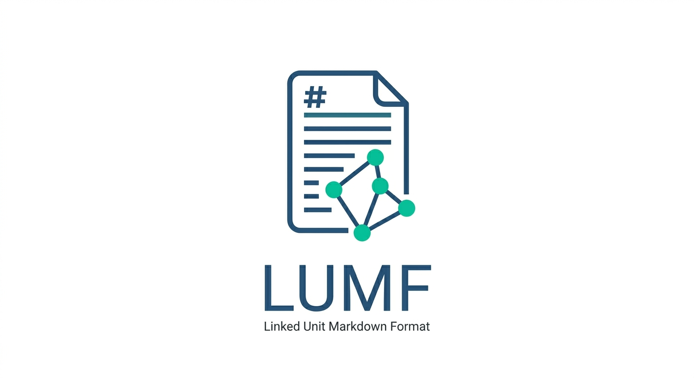
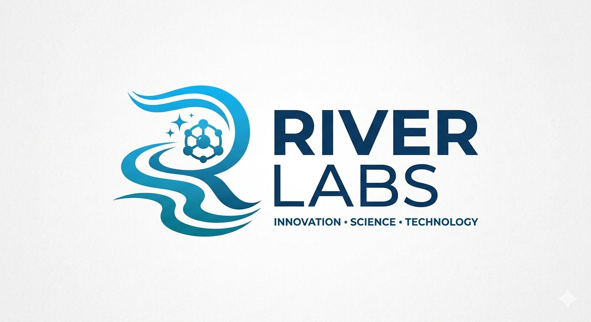

<p align="center">
  
</p>

# LUMF (Linked Unit Markdown Format)

*Проект на*  **RiverLab**


🌍 *[English](README.md)*

LUMF (Linked Unit Markdown Format) е децентрализиран, локален файлов формат за управление на бележки, задачи, напомняния и проекти. Той е базиран изцяло на чист текст (Markdown) и структурирани данни (YAML), гарантирайки, че данните са винаги четими, устойчиви във времето и напълно притежавани от потребителя.

## Основни Принципи
1. **Източник на Истина (Source of Truth)**: Самите `.md` файлове са базата данни. Всеки външен индекс е просто преходен кеш (transient cache).
2. **Атомарни Единици**: Една логическа единица (задача, бележка) = Един файл. Това драстично намалява конфликтите при синхронизация през Syncthing.
3. **Графова Мрежа**: Файловете са свързани помежду си чрез изрични YAML полета (`parent`, `children`, `blocked_by`), образувайки насочен ацикличен граф (DAG).
4. **Лесна Синхронизация**: Проектиран от самото начало за безпроблемна синхронизация между всички ваши устройства чрез инструменти като Syncthing или Git, елиминирайки риска от повреда на база данни.

## Защо за софтуерни инженери?
LUMF е създаден с мисъл за програстите (DX):
* **Без Vendor Lock-in & Лесно парсване:** Използва стандартен YAML и Markdown. Никакви криптирани файлове, затворени API-та или скрити бази данни.
* **CLI Friendly:** Базата може да бъде претърсвана и променяна чрез базови терминални инструменти (`grep`, `awk`, `sed`, `ripgrep`).
* **Git/VCS Съвместимост:** За разлика от SQLite или масивни JSON файлове, LUMF предоставя перфектен и четим `diff` при преглед на историята.
* **Свобода за автоматизация:** Лесно създаване на локални скриптове, cron jobs или Git hooks, реагиращи на промяна в статуса.

## Примери с код и автоматизация
Форматът показва пълния си потенциал, когато се обработва със скриптове.

**Намиране на всички блокирани задачи през ripgrep:**
```bash
rg "status: blocked" ./Projects -l
```

**Извличане на зависимости през Python:**
```python
import frontmatter
import glob

for file in glob.glob("*.md"):
    post = frontmatter.load(file)
    if post.get('status') == 'todo':
        print(f"Task: {post['title']} | Blocks: {post.get('blocking', 'None')}")
```
*За повече скриптове и автоматизации, вижте [docs/scripts_and_automation.bg.md](docs/scripts_and_automation.bg.md).*

## Идеи за екосистема и инструменти
Тъй като е стандартизиран, форматът позволява изграждане на богата екосистема:
* **CLI инструменти:** Мениджъри за управление на задачи през терминал (напр. `lumf add "Таск"`).
* **Разширения (Plugins):** Линтъри и инструменти за VS Code / Neovim.
* **Language SDKs:** Библиотеки (Parsers) на Python, Rust, Go и др.

*Повече за възможностите за разширяване на екосистемата четете в [docs/ecosystem_and_tooling.bg.md](docs/ecosystem_and_tooling.bg.md).*

## Сравнителна таблица

| Характеристика | **LUMF** | Notion / Jira | Obsidian / Logseq | JSON / SQLite |
| :--- | :---: | :---: | :---: | :---: |
| **Четимост от човек** | 🟢 Да (Отлична) | 🔴 Не | 🟢 Да | 🟡 Средна / Лоша |
| **Собственост на данните** | 🟢 100% Локално | 🔴 Облак (Заключени) | 🟢 100% Локално | 🟢 100% Локално |
| **Git Diff / VCS Съвместимост** | 🟢 Перфектен `diff` | 🔴 Н/П | 🟢 Добра | 🔴 Лоша (Конфликти) |
| **Вградена графова логика** | 🟢 Да (в YAML) | 🟢 Да | 🟡 Нужни са плъгини | 🟢 Зависи от схемата|
| **Нужда от специализиран софтуер**| 🟢 Не (Редактор) | 🔴 Да | 🟡 Опционално | 🔴 Да |

## Правила за Именуване на Файлове
За да се избегнат колизии при едновременна синхронизация и да се запази четимостта, всеки файл трябва да следва тази структура:

`[YYYYMMDDHHMM]-[XXXX]-[slug].md`

* **YYYYMMDDHHMM**: Времеви печат (напр. `202605271030`)
* **XXXX**: 4-символен случаен низ, предотвратяващ колизии (напр. `A1B2`)
* **slug**: Кратко описателно име на латиница (напр. `remont-bania`)

*Пример: `202605271030-A1B2-remont-bania.md`*

## Структура на Директорията (Workspace)
За да работи системата организирано, LUMF хранилището спазва следния стандарт за директориите:

```text
/LUMF_Workspace (Root)
├── .system/           # Скрита папка за системната магия
│   ├── cache/         # Временен индекс база (не се синхронизира)
│   ├── scripts/       # Скриптове за автоматизация (напр. проверки за счупени връзки)
│   └── templates/     # Шаблони за създаване на нови задачи и проекти
├── 00_Inbox/          # Бързо улавяне: необработени бележки и идеи
├── Projects/          # Активни проекти
├── Tasks/             # Самостоятелни задачи
├── _assets/           # Бинарни файлове (снимки, фактури, PDF документи)
│   └── 2026/          # Сортирани по година/тема
└── Archive/           # Архив за завършени (done/cancelled) задачи
```

## Шаблони
- **[Шаблон за Задача](.system/templates/task_template.md)**: Празен шаблон за създаване на нова задача.
- **[Шаблон за Проект](.system/templates/project_template.md)**: Празен шаблон за стартиране на нов проект.

## Примери
За да разберете как файловете си взаимодействат, разгледайте тези примери:
- **[Проект: Ремонт на банята](examples/202605271200-P1R1-bathroom-renovation.md)** (Главен проект)
- **[Покупка на плочки](examples/202605271205-T1S1-buy-tiles.md)** (Активна задача, която блокира следващата)
- **[Лепене на плочки](examples/202605271210-T2S2-install-tiles.md)** (Блокирана задача, очакваща материали)

## Допълнителна Документация
- **[Спецификация на YAML Схемата](docs/yaml_schema.bg.md)**: Подробно описание на всички полета в метаданните.
