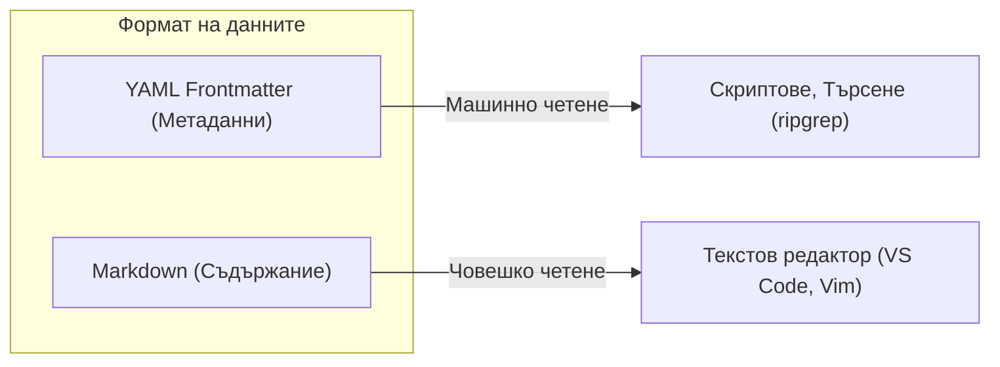
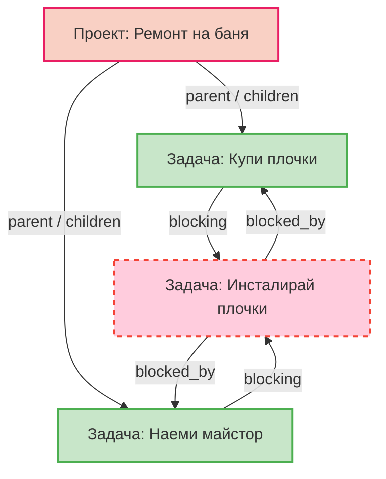
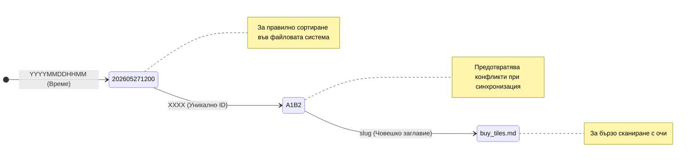
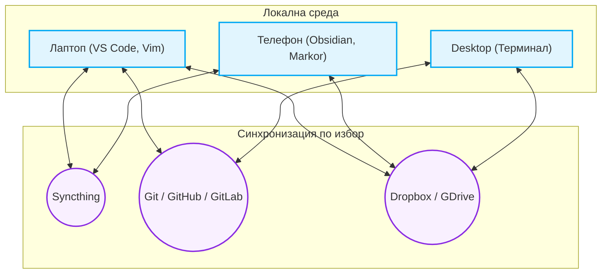

# Архитектура и Решения (ADR)

В този документ ще ви запознаем с основните архитектурни решения (Architecture Decision Records - ADR) зад LUMF. Целта му е да отговори на въпроса **„Защо?“**, а не просто „Какво?“. Разбирането на тези концепции ще ви помогне да извлечете максимума от формата.

---

## ADR 001: Markdown + YAML Frontmatter като Source of Truth

**Контекст:**  
Съществуват много начини за съхранение на структурирани и неструктурирани данни – бази данни (SQLite, PostgreSQL), JSON, чист текст. Нуждаехме се от формат, който да бъде максимално устойчив във времето, независим от конкретен софтуер (без vendor lock-in) и удобен за писане и четене от човек.

**Решение:**  
Избрахме стандартни Markdown (`.md`) файлове, обогатени с YAML Frontmatter блок. 

**Последствия:**  
* **Предимства:** Файловете могат да бъдат отворени дори след десетилетия с какъвто и да е текстов редактор. Версионирането чрез Git дава перфектно четим `diff` (за разлика от бинарни бази данни).
* **Недостатъци:** Парсването на стотици хиляди файлове може да отнеме повече време в сравнение със заявка към SQL база, което налага използването на кеширащ слой за по-големи масиви (.system/cache).

---

## ADR 002: Графова структура (DAG) вместо дълбоко влагане на папки

**Контекст:**  
Традиционните системи за управление на файлове и задачи разчитат на дълбоки дървовидни йерархии (напр. `Проекти/Работа/2026/Проект_А/задача_1.md`). Това създава проблем, когато една задача или бележка е свързана с няколко проекта или когато искате гъвкаво да преструктурирате идеите си.

**Решение:**  
Проектите и задачите седят в плитки, общи директории (`Tasks/`, `Projects/`). Връзките между тях се дефинират изрично в YAML метаданните чрез полета като `parent`, `children`, `blocked_by` и `blocking`. Това създава Насочен ацикличен граф (DAG).

**Последствия:**  
Няма твърди граници. Можете да премествате файловете между различни папки без риск да счупите връзките (защото се свързват по уникален идентификатор - `id`). Това позволява лесно визуализиране на критичния път и блокиращите зависимости.

---

## ADR 003: Конвенция за уникално именуване на файлове

**Контекст:**  
Едно от най-големите предизвикателства при децентрализирана система на файлове (например синхронизация между телефон и лаптоп през Syncthing) са конфликтите, ако два файла се създадат едновременно с едно и също име. Същевременно пълните UUID (напр. `b19324-ee44...`) са грозни и трудни за бързо сканиране с очи.

**Решение:**  
Всяка единица получава име по следния строг стандарт:  
`[YYYYMMDDHHMM]-[XXXX]-[slug].md`  

**Последствия:**  
* **`YYYYMMDDHHMM` (Задължително):** Дава автоматично хронологично сортиране във файловия мениджър. За разлика от стандартния Unix timestamp (`1716811200`), този формат остава незабавно четим за човек, но запазва строгата си логика за подредба. Липсата на тирета или точки в датата предотвратява излишно удължаване на името.
* **`XXXX` (Задължително):** Гарантира избягване на колизии при едновременно създаване чрез 4 рандом символа (достатъчна ентропия за персонална и малка екипна употреба). Двете задължителни полета заедно (`YYYYMMDDHHMM-XXXX`) формират уникалното `id` на задачата.
* **`slug` (Опционално, но силно препоръчително):** Осигурява бърза яснота за човека какво съдържа файла без да го отваря. Може да бъде променяно във времето безопасно, стига `id` (дата+рандом) да остане същото.

### Примери и "разчитане" на файловото име
За да придобиете по-ясна представа, ето няколко примера как файловете изглеждат на практика и как структурата им се декодира естествено от човек:

* `202605271200-A1B2-buy-tiles.md` -> Създаден на **27 май 2026** в **12:00 ч.** (Уникален ID: **A1B2**). Тема: _buy-tiles_ (Купуване на плочки).
* `202604140930-X9Y8-bathroom-renovation.md` -> Създаден на **14 април 2026** в **09:30 ч.** (Уникален ID: **X9Y8**). Тема: _bathroom-renovation_ (Ремонт на баня).
* `202812011545-QW3E-call-plumber.md` -> Създаден на **1 дек. 2028** в **15:45 ч.** (Уникален ID: **QW3E**). Тема: _call-plumber_ (Обаждане на водопроводчик).

---

## ADR 004: Локалното съхранение е с абсолютен приоритет (Local-first)

**Контекст:**  
В ерата на облачните услуги и SaaS (напр. Notion, Jira), потребителите често губят контрол върху данните си. Ако сървърите паднат, спре интернетът ви или компанията промени ценообразуването, достъпът е блокиран или ограничен. Офлайн работата обикновено е немислима или изпълнена с бъгове.

**Решение:**  
LUMF е изцяло "local-first" (локално-ориентиран) формат. Всички файлове се съхраняват локално на вашето устройство. Няма централен сървър, задължителен клауд, нито бази данни скрити зад затворени API-та.

**Последствия:**  
Печелите стопроцентова собственост върху данните си. Скоростта на четене и писане е мигновена и не зависи от качеството на интернет връзката. Повишава се сигурността, тъй като файловете могат да бъдат криптирани с локални инструменти.

**Пример от реалния свят:**  
Можете да отворите терминала си и да организирате или разпишете задачи за седмицата във `vim`, докато сте в самолет без Wi-Fi. Когато се приземите, всичко вече е при вас — нямате нужда от буфериране или изчакване на сървърен response.

---

## ADR 005: Използване на външни инструменти за синхронизация

**Контекст:**  
Щом данните живеят на локалния диск (поради **ADR 004**), възниква логичният въпрос "Как тези файлове се споделят между лаптопа, настолния компютър и телефона ми?" Често приложенията се опитват да решат този проблем сами, създавайки сложни, затворени механизми за синхронизация, които в крайна сметка водят до загуба на файлове или конфликти.

**Решение:**  
LUMF изцяло делегира отговорността за синхронизация, конфликт-резолюция и бекъп на специализирани външни инструменти (Bring Your Own Sync). Няма вградена синхронизация във формата или в предложената базова екосистема.

**Последствия:**  
Форматът остава гениално прост. Потребителите са свободни да избират инструмента за синхронизация, който най-добре съвпада с техния модел на работа, бюджет и изисквания към сигурността.

**Примери на какви инструменти да разчитате:**  
* **За соло-разработчици:** Децентрализирана синхронизация между устройства без сървър чрез **Syncthing**. Данните пътуват криптирано, директно между телефона и компютъра ви.
* **За софтуерни екипи:** Използване на **Git** (чрез GitHub / GitLab / локален сървър). Позволява мощно версиониране, проследяване на историята на промените и използване на Pull Requests за одобрение на нови задачи.
* **За обикновена употреба:** Папката (workspace) се поставя директно в **Dropbox, iCloud или Google Drive**, които се грижат незабавно за прехвърлянето по останалите машини.

