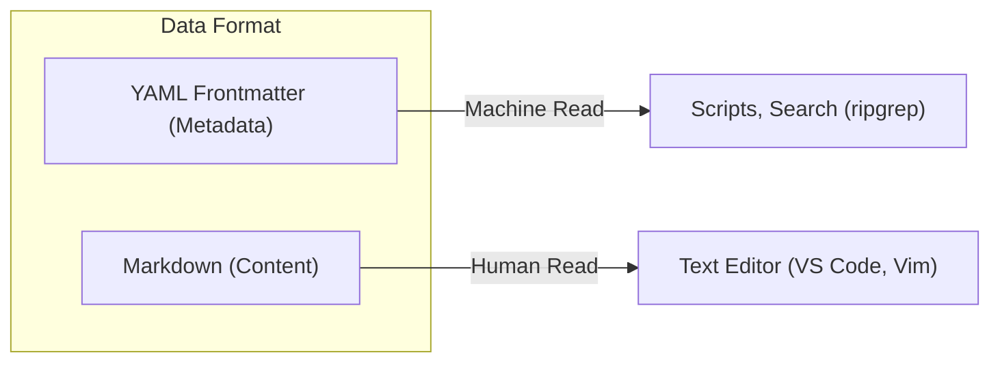
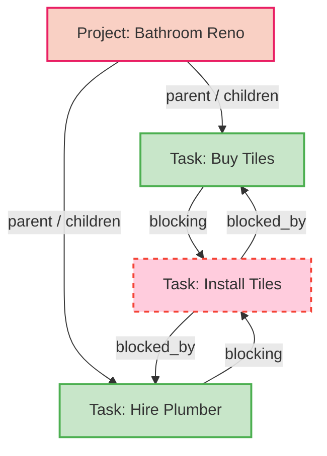
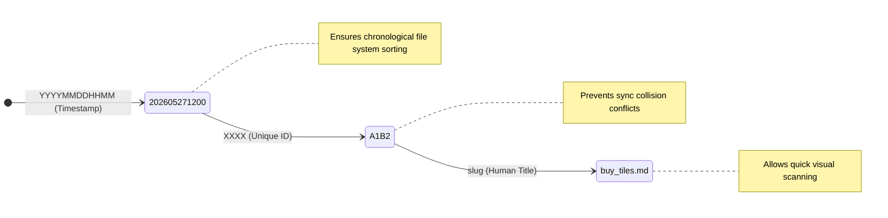
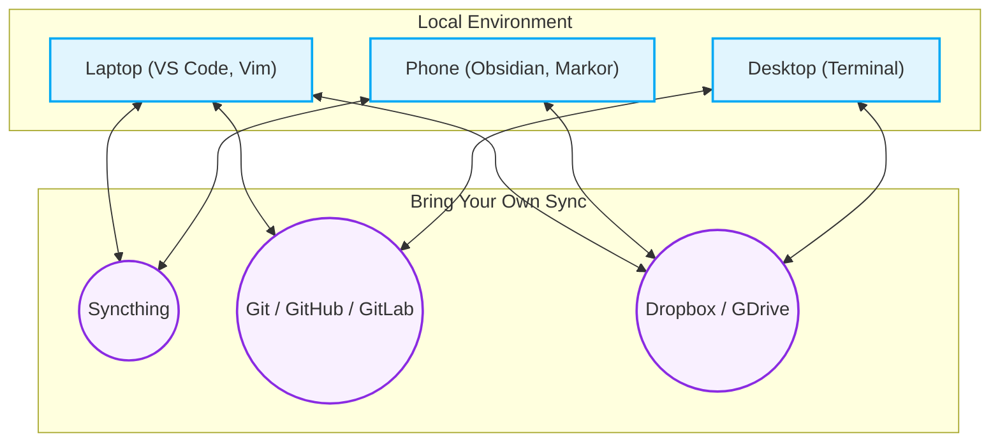

# Architecture and Decisions (ADR)

This document outlines the core Architecture Decision Records (ADR) behind LUMF. Its purpose is to answer the question **"Why?"** rather than just "What?". Understanding these underlying concepts will help you get the most out of the format.

---

## ADR 001: Markdown + YAML Frontmatter as Source of Truth

**Context:**  
There are many ways to store structured and unstructured data—databases (SQLite, PostgreSQL), massive JSON structures, or plain text. We needed a format that is profoundly future-proof, entirely independent of any specific software (zero vendor lock-in), and comfortable for human reading and writing.

**Decision:**  
We chose standard Markdown (`.md`) files enriched with a YAML Frontmatter block.

**Consequences:**  
* **Pros:** Files can be opened decades from now with any simple text editor. Version control via Git yields perfectly readable `diff`s (unlike opaque binary databases or minified JSON files).
* **Cons:** Parsing tens of thousands of plain text files on the fly can take more time compared to a single SQL query, which necessitates the use of a transient caching layer for massive workspaces (`.system/cache`).

---

## ADR 002: Graph Structure (DAG) vs. Deep Folder Nesting

**Context:**  
Traditional file and task management systems rely on deep tree-like directory hierarchies (e.g., `Projects/Work/2026/Project_A/task_1.md`). This strict taxonomy falls apart when a single task or note logically belongs to multiple projects concurrently or when shifting structure.

**Decision:**  
Items live in shallow, generic directories (`Tasks/`, `Projects/`). The relationships between them are explicitly defined in the YAML metadata through fields like `parent`, `children`, `blocked_by`, and `blocking`. This forms a Directed Acyclic Graph (DAG).

**Consequences:**  
There are no rigid structural boundaries. Files can be moved between directories without breaking path links (since relations use the unique `id`). This approach naturally supports dependency tracking (e.g., finding the critical path of blocking tasks).

---

## ADR 003: Unique File Naming Convention

**Context:**  
One of the biggest challenges in a decentralized file-based system (especially when using tools like Syncthing across a laptop and mobile phone) is collision—creating two files at the exact same time with the same name. Meanwhile, full UUIDs (like `b19324-ee44...`) hurt human readability.

**Decision:**  
Every logical unit receives a filename following this strict standard:  
`[YYYYMMDDHHMM]-[XXXX]-[slug].md`  

**Consequences:**  
* **`YYYYMMDDHHMM` (Mandatory):** Automatically provides a chronological sort order in any standard file manager. Unlike standard Unix timestamps (`1716811200`), this formatting remains inherently human-readable while preserving absolute descending/ascending sort logic. The omission of dashes or dots keeps the filename compact.
* **`XXXX` (Mandatory):** Precludes naming collisions through a 4-character random alphanumeric string (which provides sufficient entropy for personal and small-team use). Together, these two mandatory fields (`YYYYMMDDHHMM-XXXX`) form the core unique `id` of the file.
* **`slug` (Optional, but highly recommended):** Provides immediate, glanceable context about the file's contents without needing to parse the YAML metadata. The slug can be safely renamed later as long as the unique `id` remains unchanged.

### Examples and "Reading" the Filename
To give you a clearer idea, here are a few examples of how files look in practice and how their structure is naturally decoded by a human:

* `202605271200-A1B2-buy-tiles.md` -> Created on **May 27, 2026** at **12:00 PM** (Unique ID: **A1B2**). Topic: _buy-tiles_.
* `202604140930-X9Y8-bathroom-renovation.md` -> Created on **Apr 14, 2026** at **09:30 AM** (Unique ID: **X9Y8**). Topic: _bathroom-renovation_.
* `202812011545-QW3E-call-plumber.md` -> Created on **Dec 1, 2028** at **15:45 PM** (Unique ID: **QW3E**). Topic: _call-plumber_.

---

## ADR 004: Local Storage as a Strict Priority (Local-first)

**Context:**  
In the era of Cloud Services and SaaS (e.g., Notion, Jira), users forfeit control over their data. If servers go down, you lose your internet connection, or a company changes its pricing logic, your access is blocked or hindered. Native offline work is frequently impossible or laden with sync bugs.

**Decision:**  
LUMF is strictly a "local-first" format. All files reside directly on your local device. There is no central server, no required cloud account, and no databases hidden behind propriety web APIs.

**Consequences:**  
You possess 100% data ownership. Read and write latency is functionally zero because you aren't waiting on a network fetch. Privacy is drastically improved, as data can naturally be encrypted with standard local tools.

**Real-world Example:**  
You can open up your terminal and structure upcoming project tasks using `vim` or `VS Code` while on a remote flight with zero Wi-Fi. As soon as you land, your workspace is accurately reflecting your thoughts — no waiting for a UI to reload.

---

## ADR 005: Relying on External Synchronization Tools

**Context:**  
Because your workspace lives completely on a local drive (due to **ADR 004**), the immediate question becomes: "How do I share this data across my laptop, mobile phone, and desktop?" Apps frequently attempt to invent completely custom, bespoke syncing engines. This almost always leads to merge conflicts, complexity, and eventually, data loss.

**Decision:**  
LUMF purposefully delegates all responsibility for synchronization, conflict resolution, and backups to decoupled, specialized third-party software (Bring Your Own Sync). There is absolutely zero embedded networking logic in the format.

**Consequences:**  
The ecosystem remains brilliantly simple. Users are empowered to select the exact external tool that maps best to their workflow, security posture, and budget.

**Examples of Sync Tools you can rely on:**  
* **For a solo developer/user:** Decentralized, peer-to-peer sync without servers using **Syncthing**. Data travels securely and directly between a mobile device and laptop.
* **For engineering teams:** Using **Git** (via GitHub / GitLab or a self-hosted instance). It provides extremely powerful version control, history diffs, and the ability to leverage Pull Requests to evaluate new requirements or tasks.
* **For general consumer ease:** Keeping the workspace folder simply on **Dropbox, iCloud, or Google Drive**, allowing their battle-tested daemons to handle the file transfers instantly behind the scenes.

