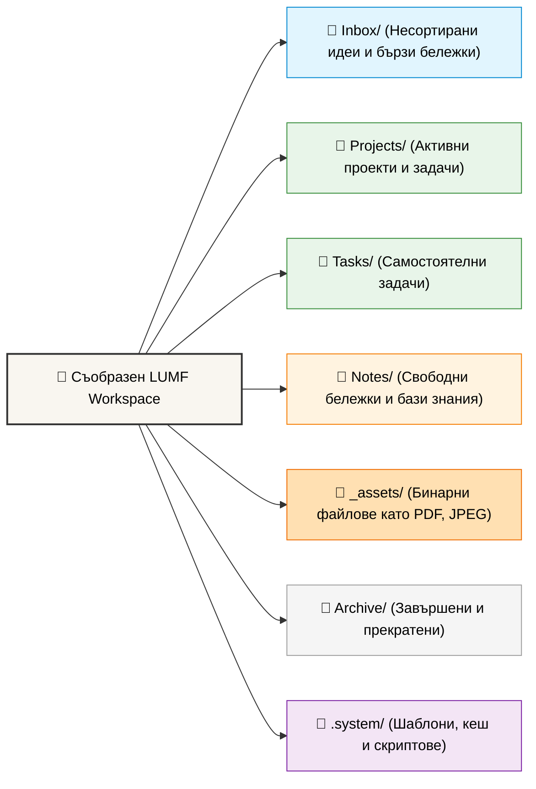

# Структура на папките в LUMF

🌍 *[English](folder_structure.md)* | 🔙 *[Обратно към README](../README.bg.md)* | 🚀 *[Getting Started](getting_started.bg.md)*

Въпреки че LUMF разчита на метаданните в YAML за създаване на графови връзки (чрез `parent` и `children`), поддържането на основна структура на папките е силно препоръчително. Това улеснява навигацията за хората и базовото филтриране.

## Визуална графика на работното пространство (Workspace)



### Представяне в дървовиден вид
За тези, които предпочитат класическия дървовиден изглед, ето как изглежда структурата в терминала (подобно на командата `tree`):

```text
/LUMF_Workspace (Root)
├── .system/           # Скрита папка за системната магия
│   ├── cache/         # Временни бързи индекси (не се синхронизират)
│   ├── scripts/       # Потребителски скриптове (bash, python)
│   └── templates/     # .md шаблони 
├── 00_Inbox/          # Необработени идеи и бележки
├── Projects/          # Активни дългосрочни проекти
├── Tasks/             # Стандартни задачи
├── Notes/             # База знания и свободни бележки
├── _assets/           # Бинарни файлове (договори, снимки)
│   └── 2026/          # (Препоръчително) Групирани по година
└── Archive/           # Завършени задачи, които пазим за справка
```

## Описание на директориите

* **`00_Inbox/`**
  Място за бързо записване. Файловете тук обикновено нямат пълни метаданни или дефиниран `parent`. Целта е да бъдат прегледани и преместени по-късно.
* **`Projects/` и `Tasks/`**
  Основната работна директория за задачи и епици. Тъй като LUMF не разчита на дълбоки папки, всички задачи могат да стоят тук или да бъдат групирани само на едно ниво (напр. `Projects/Work/`, `Projects/Personal/`).
* **`Notes/`**
  Място за обособени бележки (Zettelkasten), дневници, протоколи от срещи или идеи, които не са конкретни задачи. Идеално за съхранение на свободен текст и Reference материали.
* **`_assets/`**
  Централизирано място за всички бинарни файлове (договори, фактури, картинки). Логично е да се разделят в подпапки по година или категория.
* **`Archive/`**
  След като даден проект бъде завършен (`status: done` или `cancelled`), е добра практика файловете да се преместят тук, за да не претрупват активното търсене. Според концепцията на LUMF преместването не чупи връзките.
* **`.system/`**
  Системна скрита папка (започва с точка). В нея се пазят:
  * `templates/` - предварително подготвени `.md` файлове с общ YAML frontmatter за бързо създаване.
  * `cache/` - бързи индекси за скриптове.
  * `scripts/` - потребителска автоматизация.

---

👉 **Следваща стъпка:** [Спецификация на YAML Схемата](yaml_schema.bg.md)
