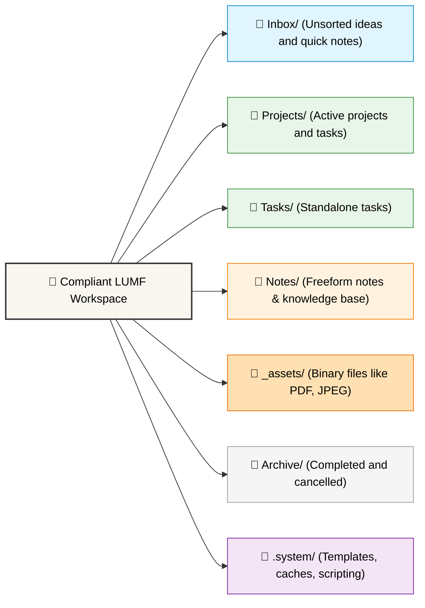

# Folder Structure in LUMF

🌍 *[Български](folder_structure.bg.md)* | 🔙 *[Back to README](../README.md)* | 🚀 *[Getting Started](getting_started.md)*

Although LUMF relies on YAML metadata for creating graph connections (via `parent` and `children`), maintaining a basic folder structure is highly recommended. It simplifies human navigation and basic filtering.

## Workspace Visual Graph



### Text Tree Representation
For those who prefer a classic text-based tree view, here is how the structure looks (similar to the standard `tree` command):

```text
/LUMF_Workspace (Root)
├── .system/           # Hidden directory for systemic elements
│   ├── cache/         # Fast-read transient indexes (not synced)
│   ├── scripts/       # Automation scripts (bash, python, etc.)
│   └── templates/     # Boilerplate .md templates
├── 00_Inbox/          # Unprocessed raw notes or ideas
├── Projects/          # Active long-term projects
├── Tasks/             # Standalone tasks
├── Notes/             # Knowledge base and freeform text
├── _assets/           # Binary files (images, PDFs)
│   └── 2026/          # (Recommended) Grouped by year
└── Archive/           # Finished or cancelled items kept for reference
```

## Directory Descriptions

* **`00_Inbox/`**
  A place for quick capture. Files here usually lack complete metadata or a defined `parent`. The goal is to review and move them later.
* **`Projects/` and `Tasks/`**
  The main working directory for tasks and epics. Since LUMF does not rely on deep folder hierarchies, all tasks can live here flat or grouped just one level deep (e.g., `Projects/Work/`, `Projects/Personal/`).
* **`Notes/`**
  A place for standalone notes, Zettelkasten knowledge, daily logs, meeting minutes, or ideas that aren't strictly executable tasks. Perfect for freeform text and reference materials.
* **`_assets/`**
  A centralized place for all binary files (contracts, invoices, images). It's logical to further separate them into subfolders by year or category.
* **`Archive/`**
  Once a project is finished (`status: done` or `cancelled`), it's best practice to move the files here to keep active searches fast and clean. Thanks to LUMF's design, moving files does not break graph links.
* **`.system/`**
  A hidden system folder (starts with a dot). Inside it, you can keep:
  * `templates/` - boilerplate `.md` files with generic YAML frontmatter for quick creation.
  * `cache/` - fast cache indexes for your search scripts.
  * `scripts/` - user-provided custom automation.

---

👉 **Next step:** [YAML Schema Specification](yaml_schema.md)
