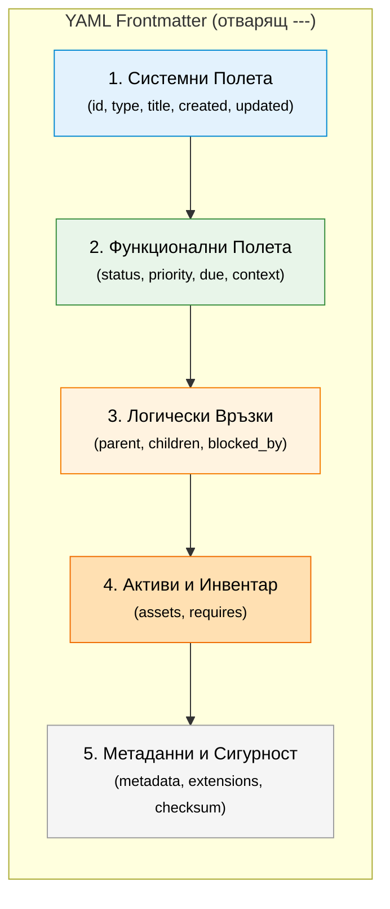

# LUMF YAML Спецификация на Метаданните

🌍 *[English](yaml_schema.md)* | 🔙 *[Обратно към README](../README.bg.md)* | 🚀 *[Getting Started](getting_started.bg.md)*

Всеки LUMF файл трябва да започва с YAML блок (Frontmatter), затворен между `---`. Тези метаданни правят файловете четими за машината и позволяват на системата да функционира като децентрализирана база данни.

## Визуално подреждане на блоковете (Препоръчително)
Въпреки че редът на ключовете в YAML няма значение за парсърите, следването на тази логическа текстова структура отгоре-надолу значително улеснява човешкото око:



## 1. Системни Полета (Задължителни)
Тези полета са задължителни за всеки LUMF файл.

* `id` *(String)*: Пълният уникален идентификатор, който съвпада с началото на името на файла (напр. `202605271030-A1B2`). Използва се за връзки, дори ако името на файла се промени.
* `type` *(String)*: Тип на обекта. Поддържани стойности: `task`, `note`, `project`, `reminder`, `asset`.
* `title` *(String)*: Заглавие на документа (четимо от човек). Трябва да е в кавички, ако съдържа двоеточие.
* `created` *(Datetime)*: Дата на създаване във формат ISO 8601 (`YYYY-MM-DD HH:mm:ss`).
* `updated` *(Datetime)*: Дата на последна модификация. Критично за инвалидиране на кеша и разрешаване на конфликти от Syncthing.

## 2. Функционални Полета (Опционални)
Използват се предимно за задачи, проекти и напомняния.

* `status` *(String)*: Текущо състояние. Стойности: `todo`, `in_progress`, `blocked`, `failed`, `done`, `cancelled`.
* `status_reason` *(String)*: Причина за `blocked`/`failed` (напр. `blocked_by_materials`).
* `priority` *(String)*: Приоритет. Стойности: `low`, `medium`, `high`, `critical`. 
* `start_after` *(Date/Time)*: Най-ранна дата/час за започване (напр. `YYYY-MM-DD`).
* `due` *(Date/Time)*: Краен срок за изпълнение (напр. `YYYY-MM-DD`).
* `duration_estimate` *(String)*: Оценка на продължителност (напр. `2d`, `6h`, `90m`).
* `color` *(String)*: Визуален маркер. Може да е семантично име (`red`, `urgent-red`) или Hex код (`#ff5733`).
* `context` *(Array)*: Масив от контексти / тагове за средата (напр. `[home, office, supermarket, phone]`).
* `assigned_to` *(Array)*: Включени хора/екипи (involved people), не задължително отговорник (напр. `["Екип монтаж", "Архитект"]`).
* `location` *(String)*: Локация или помещение (напр. `"Баня"`).

### Custom statuses (гъвкаво)
За потребителска гъвкавост може да дефинирате собствени статуси, които допълват стандартните.

* `custom_statuses` *(Array)*: Списък с позволени custom статуси (напр. `[waiting_review, waiting_delivery]`).

## 3. Логически Връзки (Опционални)
Поддържат графовата връзка (DAG) между файловете.

* `parent` *(String)*: ID на главния проект или задача.
* `children` *(Array)*: Списък от ID-та на подзадачите към този файл.
* `blocked_by` *(Array)*: Списък от ID-та на задачи, които *трябва* да бъдат завършени, за да може тази задача да започне.
* `blocking` *(Array)*: Списък от ID-та на задачи, които тази текуща задача блокира.

## 4. Активи и Инвентар (Опционални)
* `assets` *(Array от Обекти)*: Директни връзки към бинарни файлове в `_assets/`.
  * `path` *(String)*: Релативен път от корена (напр. `_assets/2026/invoice.pdf`).
  * `label` *(String)*: Описание на актива (напр. `"Фактура за части"`).
* `requires` *(Array)*: Необходими инструменти или материали за задачата (напр. `["Чук", "2 торби цимент"]`).

## 5. Метаданни, Разширяемост и Сигурност (Опционални)
Тези блокове осигуряват допълнителна гъвкавост, интегритет и бъдеща съвместимост на формата.

* `metadata` *(Object)*: Контейнер за описателна и системна информация.
  * `author` *(String)*: Създател или последен редактор на файла (напр. `"Иван Иванов"`, `"SystemBot"`).
  * `locale` *(String)*: Език и регионални настройки (напр. `"bg-BG"`, `"en-US"`).
  * `dependencies` *(Array)*: Външни ресурси, схеми или плъгини, нужни за пълноценното зареждане на файла.
* `extensions` *(Object)*: Изолиран контейнер (Custom Data) за специфични за потребителя или приложението данни, които не са част от официалния стандарт. Парсерите могат безопасно да игнорират този блок.
* `checksum` *(String)*: Контролна сума (напр. `sha256-...`) за проверка на валидността и интегритета на файла при синхронизация.

## Пример
```yaml
---
id: 202605271030-A1B2
type: task
title: "Закупуване на плочки"
created: 2026-05-27 10:30:00
updated: 2026-05-27 10:45:00

metadata:
  author: "Rosen"
  locale: "bg-BG"
  dependencies: ["https://schemas.example.com/tiles_plugin"]

checksum: "sha256-a1b2c3d4e5f6..."
extensions:
  custom_billing_id: "BILL-999"

status: todo
status_reason: blocked_by_materials
priority: high
start_after: 2026-05-28
due: 2026-05-30
duration_estimate: 2d
context: [supermarket, driving]
assigned_to: ["Екип монтаж"]
location: "Баня"

custom_statuses: [waiting_review, waiting_delivery]

parent: 202605270900-R2D2
blocked_by: []
blocking: [202605271100-C3P0]

assets:
  - path: "_assets/2026/quote.pdf"
    label: "Ценова оферта"
---
```

---

👉 **Следваща стъпка:** [Скриптове и Автоматизация (Очаквайте скоро)](scripts_and_automation.bg.md)